# Examen Práctica Unidad II - PETI

**Alumno:** Jesus Humberto Escalante Alanoca  
**Fecha:** [Fecha de entrega: 27 de mayo de 2026]

## Repositorio del Proyecto

[URL del repositorio en GitHub](https://github.com/JesusEscalante/PE_II_EXAMEN_PRACTICO.git)

## Mejoras Realizadas al Sistema

A continuación se describen las mejoras implementadas en el sistema como parte de la práctica de la Unidad II:

1.  **[Mejora 1, Analisis Interno y Externo independiente para cada Plan Estrategico de TI]**  
    *Descripción breve: Se implemento el analisis interno (analisis de cadena de valor y analisis de participacion) y el analisis externo (analisis de fuerzas de porter y analisis pest) de manea independiente para cada plan estrategico de TI y por usuario.*

2.  **[Mejora 2, Colaboradores de Plan Estrategico de TI]**  
    *Descripción breve: Se implemento la funcion de gestionar los colaboradores para cada plan estrategico, estos colaboradores podran realizar los diferentes analisis internos y externos de manera independiente por cada colaborador (usuario).*

## Capturas de Pantalla

A continuación se muestran las evidencias visuales de las mejoras aplicadas:

### Vista previa de la mejora 1
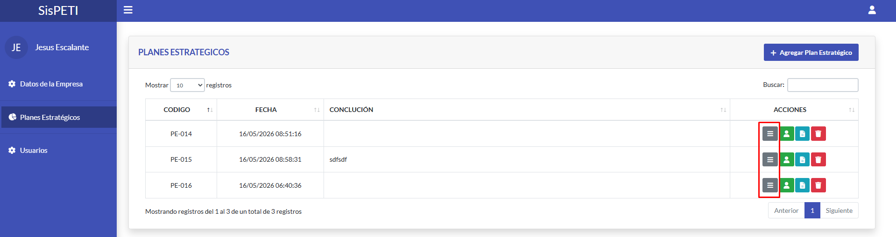

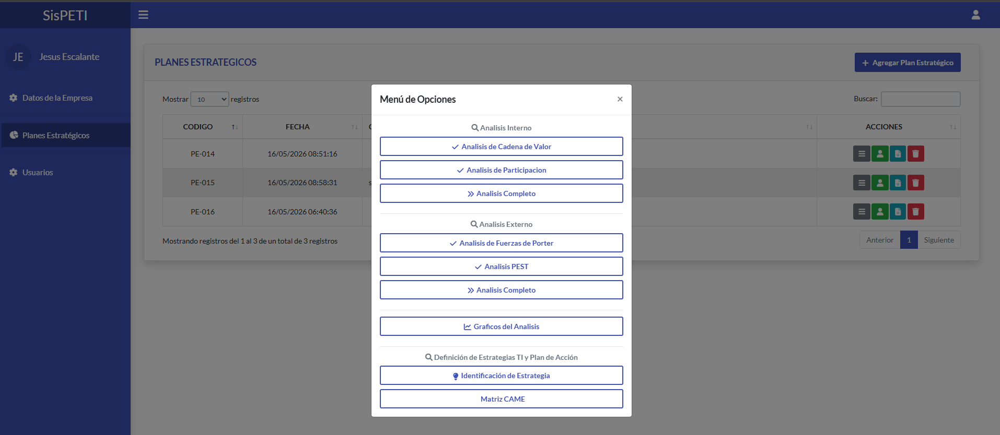

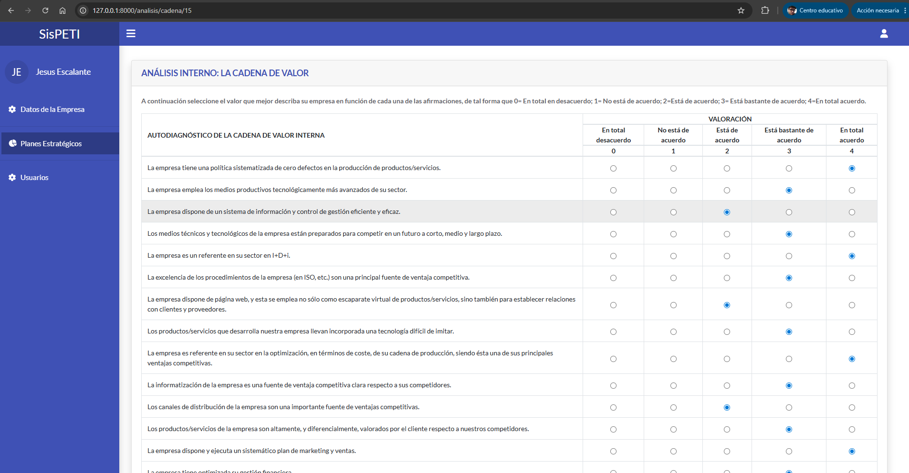

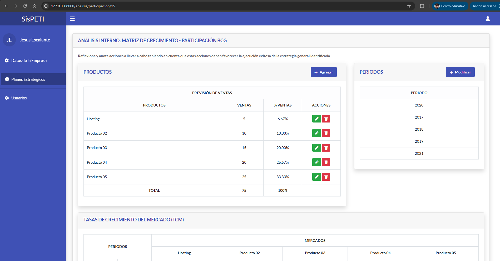

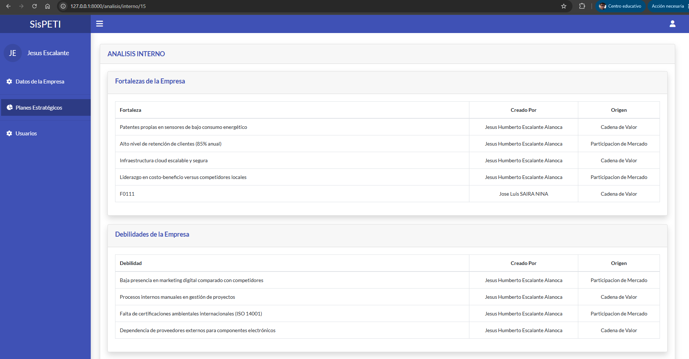

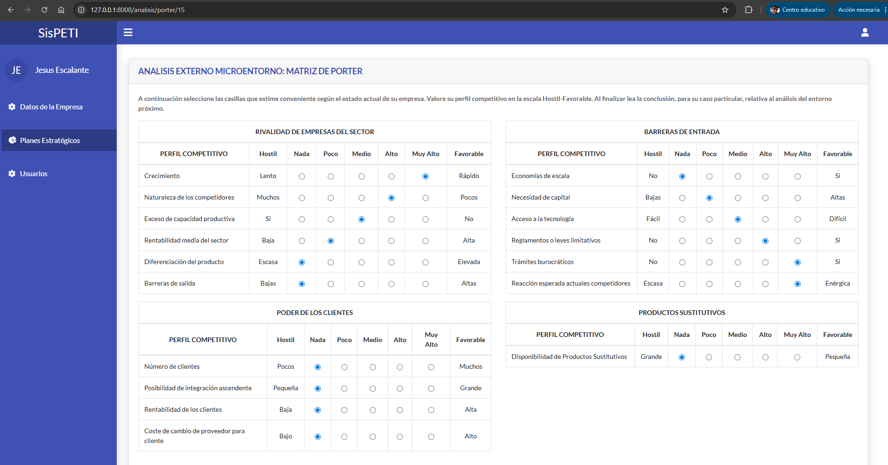

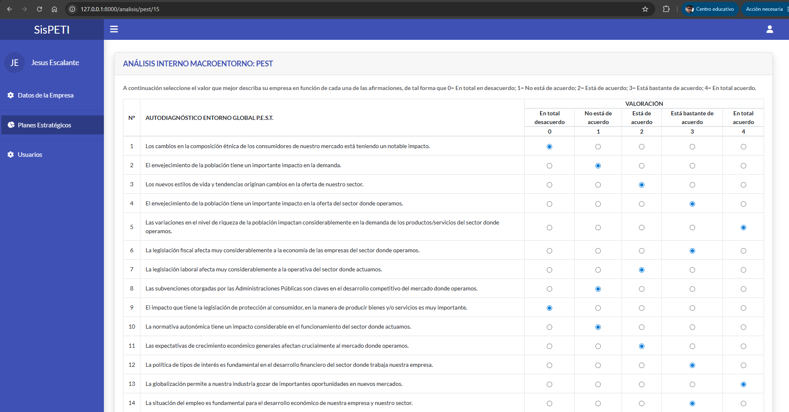

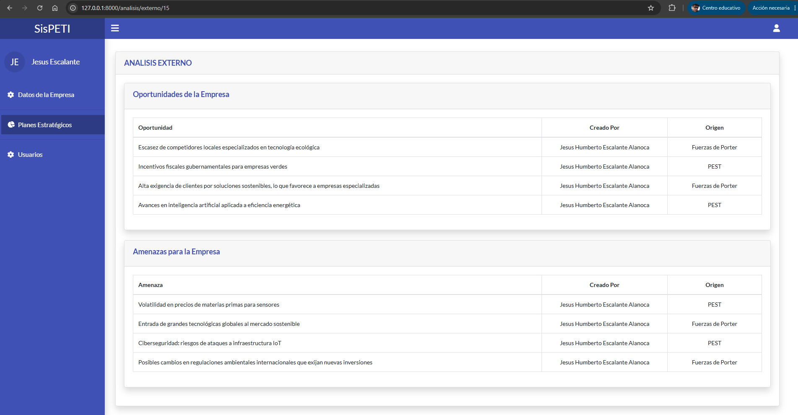

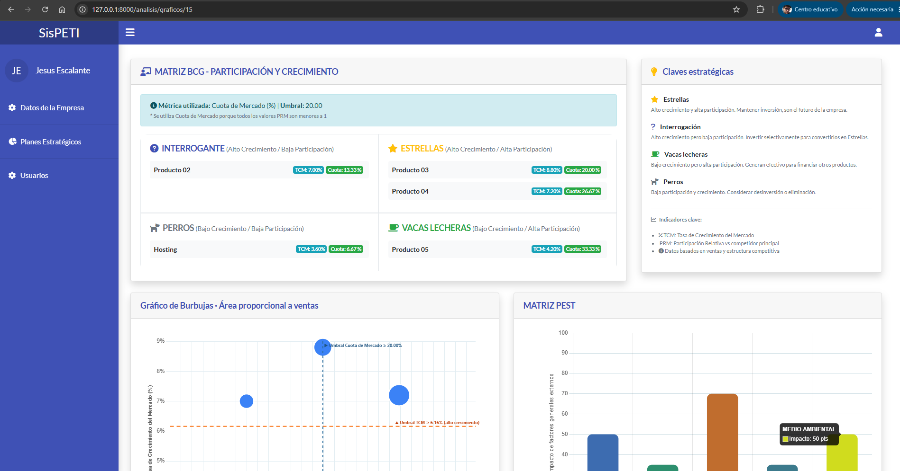

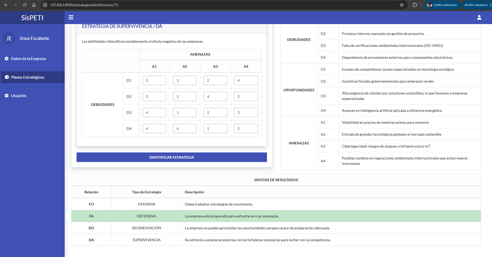

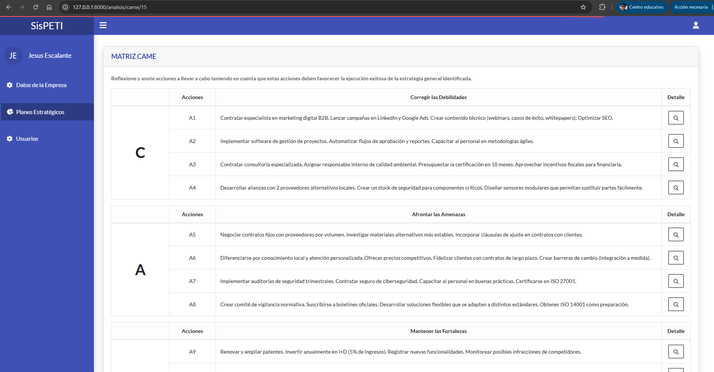

### Vista previa de la mejora 2


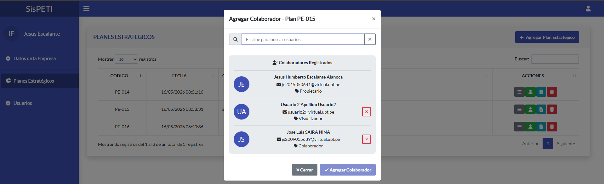

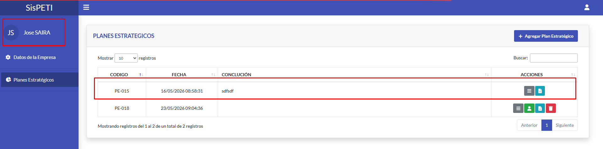

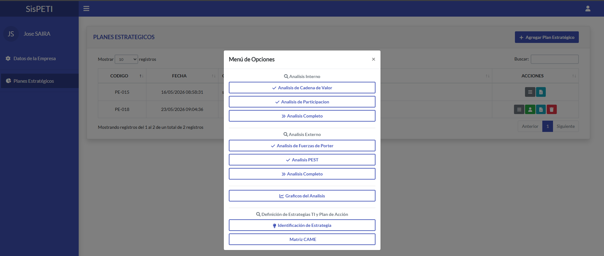

## Instrucciones para ejecutar el proyecto localmente

### Requisitos previos

- PHP 7.2 - 7.4 (cualquier versión dentro de este rango)
- Composer (gestor de dependencias de PHP)
- MySQL (5.7 o superior recomendado)
- Servidor web (XAMPP, WAMP, Laragon o artisan propio de Laravel)

### Pasos de instalación

1. **Clonar el repositorio**
   ```bash
   git clone https://github.com/JesusEscalante/PE_II_EXAMEN_PRACTICO.git
   cd PE_II_EXAMEN_PRACTICO/Aplicativo

2.  Configurar el archivo de entorno:
    ```bash
    cp .env.example .env

3.  Levatar el aplicativo:
    ```bash
    php artisan serv

1.  Igresar en cualquier navegador
    [https://127.0.0.1:8000](https://127.0.0.1:8000)